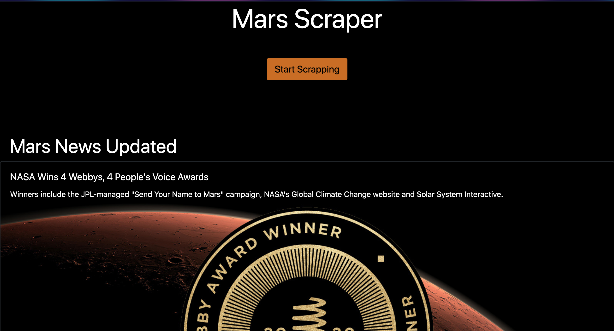
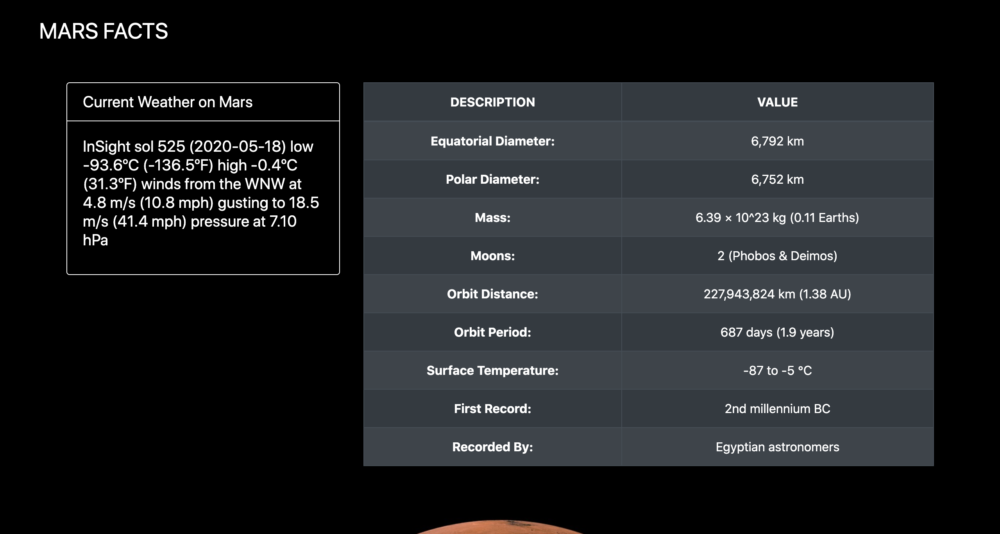
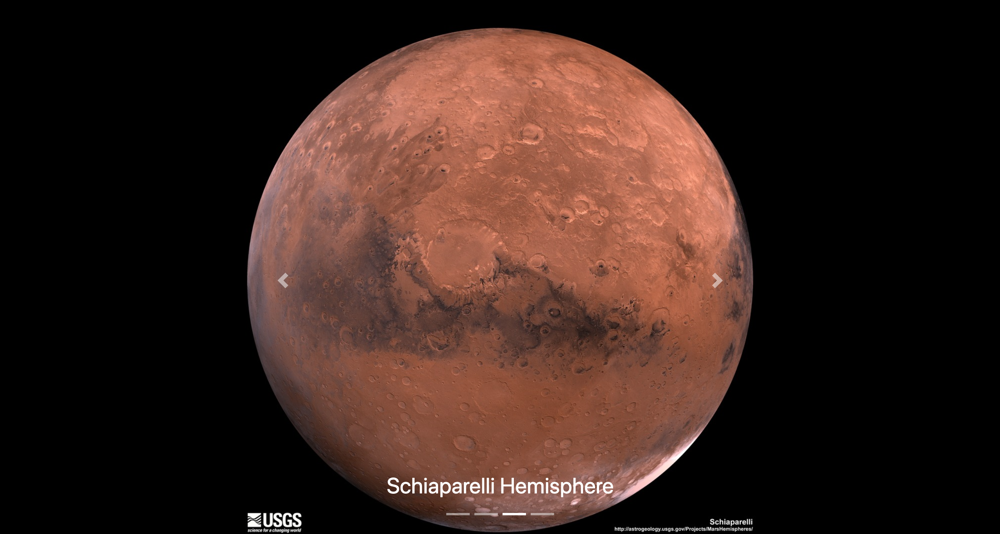

# Mission-to-Mars

      

## Introduction

This web application scrapes various websites for data related to the Mission to Mars and displays the information in a single HTML page.

## Steps

- Step 1 - Scraping
- Step 2 - MongoDB and Flask Application
- Step 3 - Display

## Data

Data was obtained from :
- [NASA Mars News Site](https://mars.nasa.gov/news/?page=0&per_page=40&order=publish_date+desc%2Ccreated_at+desc&search=&category=19%2C165%2C184%2C204&blank_scope=Latest "Mars")
- [Official twitter](https://twitter.com/marswxreport?lang=en "Twitter")
- [Mars Fact](https://space-facts.com/mars/ "Mars Facts")

### Tools

The following tools were used to do scrapping, web page and deployment

+ Python
    + requests
    + json
    + GetOldTweets3
    + pandas
    + flask
    + os
+ MongoDB
+ Jupyter Notebook
+ HTML

Below you can see a few screenshots of the web page. Or you can visit it [here](https://enr1que319-mars-scrapper.herokuapp.com "Mars Scrapper")

     
     
     
